---
tags:
    - KVM
    - Linux

update_time: 2024-02-04
create_time: 2024-02-04
---


# 虚拟硬件入门

虚拟机称之为“虚拟”，自然是因为它运行在软件虚拟的硬件上。在 kvm/qemu/libvirt 生态中，大部分硬件由 qemu 模拟，本文从 `virt-manager` 的 `virtual hardware details` 页入手，介绍常见虚拟硬件和更高阶的硬件配置方法。


<!-- more -->


## Virt-manager 操作简介

Virt-Manager 在打开一个虚拟机后会显示该界面：

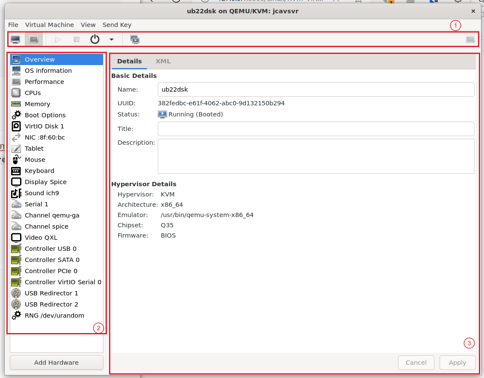{: .img-w100}

最常用的工具都集中在 ① 号区域，工具条区。从做到有有一堆按钮，分别是：

1.   `Graphics Console`：远程桌面或远程终端
2.   `Hardware Details`：硬件详细信息，也就是上图的界面
3.   4 个虚拟机电源相关按钮：`启动`、`暂停/继续`、`关机`、`其他关机指令`
4.   `Manage Snapshot`：管理虚拟机快照
5.   最右侧还有个按钮，`全盘显示远程桌面`


在硬件详细信息页面，左侧②好区域是硬件列表。虽然你很难说”OS Information“这种东西是一个硬件，但也习惯性得列在这了。

右侧 ③ 号区域是每个硬件的详细信息，有两个选项卡：

*   `Details` 选项卡：选中后将图形化得展示这个硬件的各个配置项
*   `XML` 选项卡：选中后将展示硬件配置的原始 XML 代码。`libvirtd` 使用 `xml` 格式的配置文件来描述虚拟机。`XML` 用更底层的形式展示虚拟机配置信息。

默认情况下 `XML` 以只读形式展示配置文件，不允许编辑，开发者也鼓励大家使用图形化界面配置虚拟机硬件，这足以覆盖 99% 的管理需求。但真遇到一些需要手动编辑 XML 文件的情况，按照下述流程允许编辑 XML：

*   回到 `Virt-Manager` 初始页面，按照下图设置：
    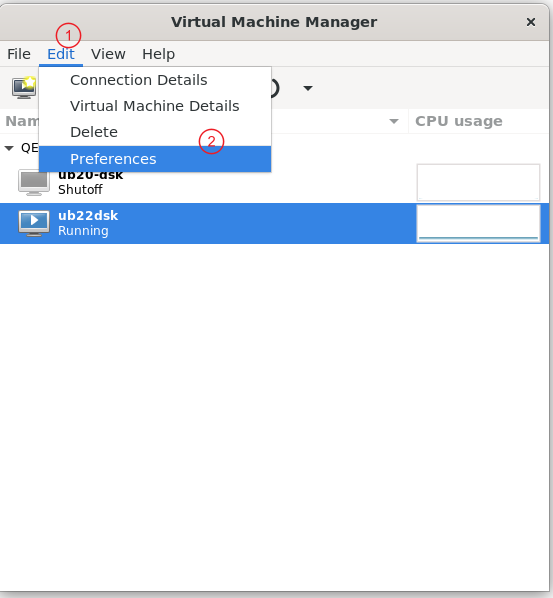

*   允许编辑 XML

    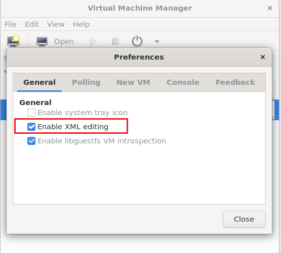


## 虚拟硬件介绍

### 系统信息

| 不要吐槽为啥“信息”是硬件，他列在这了我也没啥办法

**Overview**

这一页没啥东西，稍微重要的是 `Basic Details` 中的 `Name`，对虚拟机的管理一般都使用 name 来表示一个虚拟机，不太会用那个常常的 UUID

**OS Information**

就是安装虚拟机时选择的系统类型，没啥用。

**Performance**

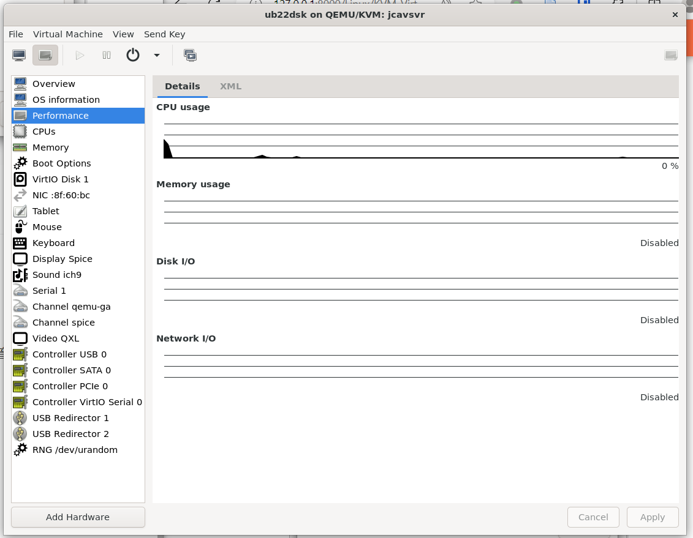

简单列出虚拟机的一些性能指标，用处不大。


### CPUs

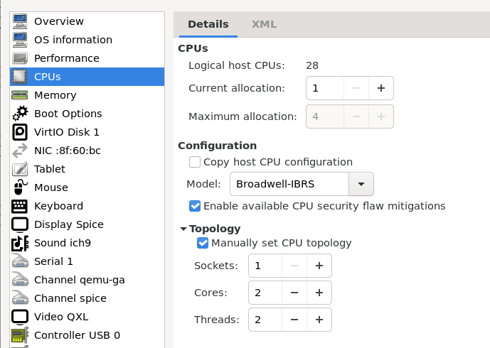

各配置项解释如下：

*   CPUs
    *   Logical host CPUs：宿主机有多少颗逻辑核心。这台宿主机插了 1 块 CPU，有 14 个核心，开启了超线程，所以逻辑核心数量 = 1 * 14 * 2 = 28
    *   Current allocation: 目前分配给虚拟机的核心数量
    *   Maximum allocation：最多分配给虚拟机多少核心
    *   这里的 *分配* 是一种共享的、不确定的分配。一个逻辑核心分配给虚拟机并不意味着宿主机和其他虚拟机无法使用该核心。默认设置下，也无法确定虚拟机运行在哪些物理核心上，也不保证不会从一个逻辑核心迁移到其他逻辑核心。不过通过编辑 XML 文件，可将虚拟机绑定到确定的几个逻辑核心
    *   此外，可为单个虚拟机分配超过宿主机逻辑核心数量的核心。另一方面，为所有虚拟机分配的核心数量可大于宿主机逻辑核心数量
*   Configuration
    *   Copy host CPU configuration 与 Model 选择框：虽然都是 x86、x64 架构的 CPU，但不同代、不同型号的 CPU 支持的指令集、特殊特性还是有些细微不同，所以需要指定 CPU 的 Model。除非是特殊情况，一般都是选择 `Copy host CPU configuration` 复制宿主机的 CPU 型号
    *   Enable available CPU security flaw mitigations：一般都会勾选
    *   CPU 型号选择指南： [Recommendations for KVM CPU model configuration on x86 hosts — QEMU documentation](https://www.qemu.org/docs/master/system/i386/cpu.html)
*   Topology
    *   sockets: 虚拟的主板上插了几个 CPU
    *   cores: 每个 CPU 有多少个核心
    *   threads: 每个核心通过超线程技术能运行多少个线程
    *   最后虚拟机的逻辑核心数 = sockets * cores * threads
    *   一般都选择单 CPU 多核心结构，这是消费级电脑最常见的硬件结构


### Memory

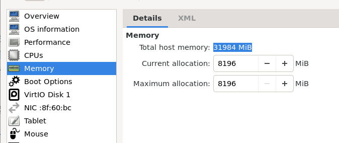

类似 CPU 分配，为虚拟机分配的内存大小可大于宿主机实际内存大小。


### Boot Options

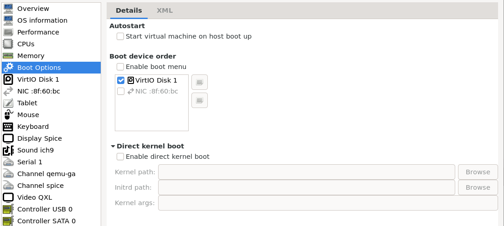

*   Autostart：字如其意
*   Boot device order：选择从哪个设备启动的优先顺序
*   Direct kernel boot：正常情况下都不会启用该选项。只在需要快速开发、调试 Linux 内核时才会用到，该选项使虚拟机使用指定的内核、`initrd` 和参数启动。


### Storage

Storage 指硬盘这类硬件，其中最常见的是 `VirtIO Disk `类型：

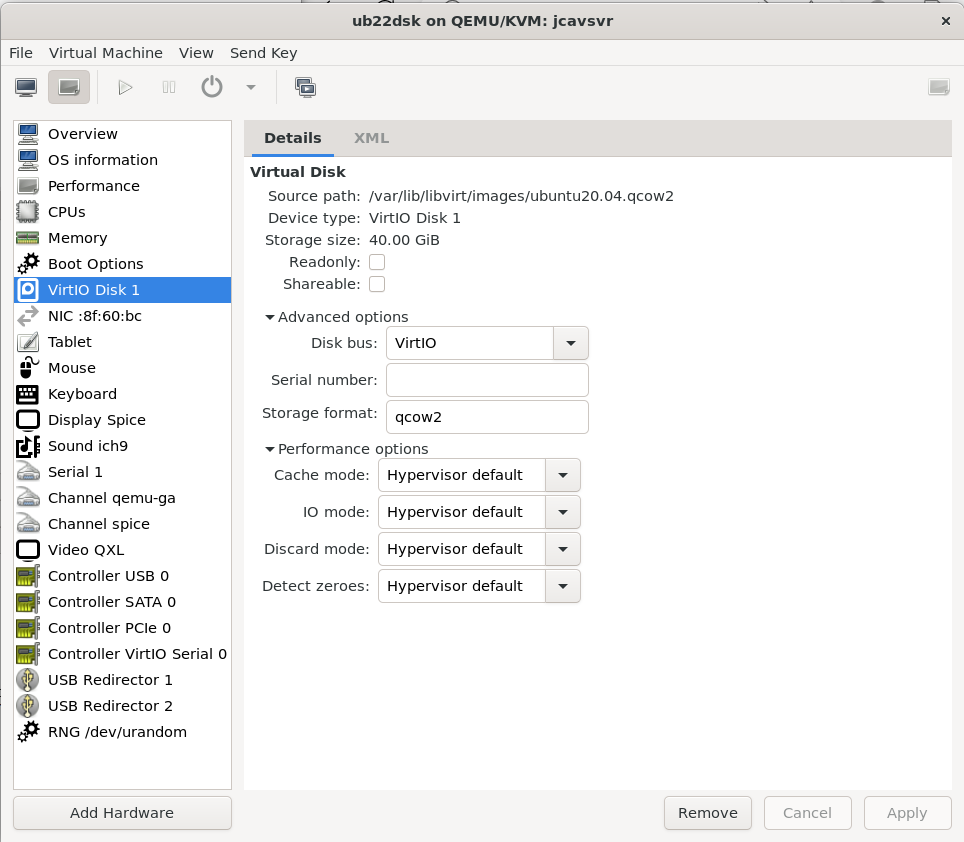


除非你能保证自己脑袋清醒，了解每个参数的含义，否则不建议修改这一页的各项参数。大部分情况下默认参数的硬盘性能已经足够使用，很多新手自以为能优化性能的修改其实最终收益都不大。

**什么是 VirtIO ?**

VirtIO 是为 Linux 开发的一套 IO 半虚拟化框架，可为虚拟机提供硬盘、网络等 IO 设备的虚拟化。虽然也可选择全虚拟化方式模拟硬盘、网络，但这得老老实实模拟硬件的所有细节，导致 IO 性能会非常非常差，所以 KVM 虚拟机普遍选择使用半虚拟化框架 VirtIO 虚拟各个 IO 设备。因为是半虚拟化，需要在虚拟机系统中安装 VirtIO 驱动。好消息是较新的 Linux 内核自带 VirtIO 驱动，坏消息是对 Windows 系统需要在安装系统时额外安装 VirtIO 驱动才能识别 VirtIO 模拟的硬盘，Windows 虚拟机创建过程详见其他文章。

想更进一步了解 VirtIO？

*   [libvirt: Virtio](https://wiki.libvirt.org/Virtio.html)
*   [Introduction to VirtIO (oracle.com)](https://blogs.oracle.com/linux/post/introduction-to-virtio)


### 网卡

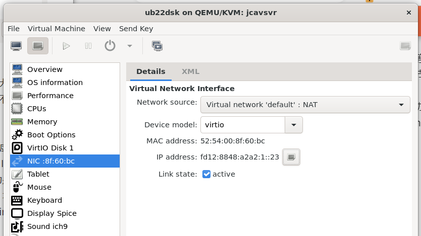

*   Network source: QEMU 从宿主机的哪个网卡/网桥收集数据包交给虚拟机上的网卡

    *   一般情况下推荐按照上图进行配置，`default` 是安装 KVM/QEMU/LIBVIRT 生态时自动创建的虚拟网络，通过 NAT 共享宿主机的 IP 地址，满足基本的互联网访问需求，同时可同 `default` 网络中其他虚拟机进行网络通信
    *   进阶配置比较复杂，会有后续文章详细介绍，敬请期待

*   Device model: 模拟成什么型号的网卡插在虚拟机上，有这么几种选项：

    *   `e1000e`：模拟 Intel 出品的一张网卡，全虚拟化方案。兼容性非常好，可以运行在非常老旧的系统上。但这张网卡结构复杂，所以模拟性能较差
    *   `rtl8139`：模拟 Realtek 的一张网卡，全虚拟化方案。该网卡硬件结构相对简单，但系统兼容性稍差，只兼容没有那么老旧的系统
    *   `VirtIO`：半虚拟化方案，要求虚拟机系统安装 VirtIO 驱动。较新的 Linux 内核自带 VirtIO 驱动，Windows 系统需要在安装系统时先安装 VirtIO 驱动。因为是半虚拟化方案，网络性能最强。

    总的来说，推荐使用 `VirtIO` 模型，避免网络性能损失。

*   其他：剩下的就是一些网络状态信息，不需要过多介绍


### 输入外设

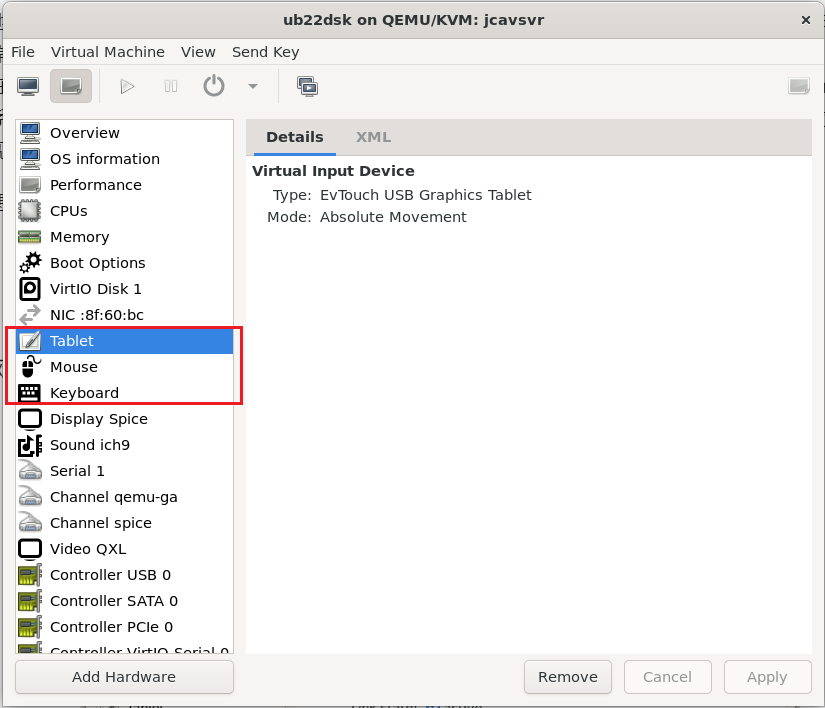

这里分成了 3 行，输入设备*类型*分别是触摸板、鼠标、键盘。但同一类设备可选择不同的*IO总线*，点击 `Add Hardware` ，然后再 `input` 找到还未添加的输入设备：

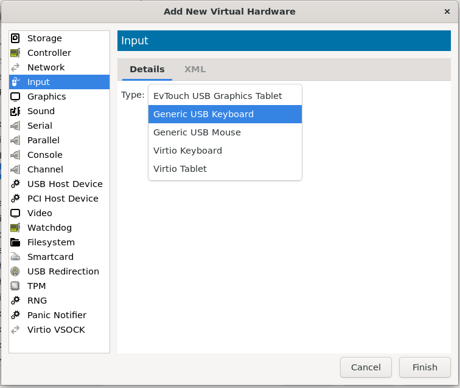

从名称可看出有这么几种总线：

*   USB，所有用过电脑的人都很熟悉的 USB 接口。现在新买的鼠标、键盘都是使用 USB 接口的了
*   Generic PS2，一种非常非常老旧但还在使用的接口，优点是不需要安装驱动就可使用鼠标、键盘。现在几乎买不到 PS2 接口的键鼠，但因为 PS2 兼容性非常好，反而适合虚拟机
*   VirtIO，半虚拟化方案，但因为输入外设的 IO 数据量都不大，没啥性能考虑，所以一般不使用该选项


### 图像设备 Display & Video

虚拟机的对图像设备的处理包含两个部分：

*   Video: 虚拟一张插在虚拟机上的显卡，有这么几种类型
    *   QXL：能很好的平衡性能与兼容性的显卡模型，要求虚拟机系统安装相应显卡驱动。版本不是特别老的 linux 系统基本自带该驱动，但 Windows 需要在安装系统后额外安装 QXL 驱动
    *   VGA：非常老旧但兼容性极佳的显卡模型
    *   VirtIO: 半虚拟化解决方案，同样要求虚拟机系统安装对应驱动
*   Display：虚拟一个显示屏，用来展示虚拟机的桌面。有三种类型：
    *   `sdl`、`gtk` 等：在宿主机的桌面上打开一个窗口显示虚拟机桌面。但大部分宿主机都是无桌面的服务器，所以这类类型不常用
    *   `vnc server`：用远程桌面的展示虚拟机桌面。启动一个 VNC 服务器，用户可从任意电脑使用任何支持 VNC 协议的客户端连接到该服务器，显示虚拟机桌面
    *   `spice server`：也是远程桌面，但使用 SPICE 协议。该协议为虚拟机场景做了许多针对性优化，使用体验也是最好的

如果虚拟机不需要图像显示，将硬件列表中的 Video、Display 和附带的 Channel（后文将介绍） 删除即可。

按照笔者经验：

*   虚拟机安装 Linux 类系统：使用 QXL + SPICE server 体验最佳
*   虚拟机安装 Windows 系统：使用 QXL + Window 自己的 RDP 体验最佳

上文提到的各种方法 3D 图像性能都非常差，如果想再虚拟机中获得媲美裸机的图像性能，可以考虑显卡直通、虚拟显卡等技术。但这些技术过于复杂，之后会将相关内容独立成文进行详细介绍。

显卡性能是虚拟化技术中最复杂的部分之一，下面是一些参考资料，本文未能详尽之处可在这些资料中寻找：

*   [20.16.12. Graphical framebuffers Red Hat Enterprise Linux 6 | Red Hat Customer Portal](https://access.redhat.com/documentation/en-us/red_hat_enterprise_linux/6/html/virtualization_administration_guide/sub-section-libvirt-dom-xml-devices-graphical-framebuffers)
*   [20.16.13. Video Devices Red Hat Enterprise Linux 6 | Red Hat Customer Portal](https://access.redhat.com/documentation/en-us/red_hat_enterprise_linux/6/html/virtualization_administration_guide/sub-section-libvirt-dom-xml-devices-video)
*   [QEMU/Guest graphics acceleration - ArchWiki (archlinux.org)](https://wiki.archlinux.org/title/QEMU/Guest_graphics_acceleration)
*   [GPU virtualization with QEMU/KVM | Ubuntu](https://ubuntu.com/server/docs/gpu-virtualization-with-qemu-kvm)
*   [VGA and other display devices in qemu | 🇺🇦 kraxel’s news](https://www.kraxel.org/blog/2019/09/display-devices-in-qemu/)


### 字符设备

除了使用图形界面与虚拟机交互，还可使用字符设备与虚拟机交互。常见的字符设备有：console, serial, parallel 和 channel


#### console, serial, parallel

*   Console，控制台设备。这个设备比较微妙，得从计算机历史发展的角度出发理解
    *   早期计算机只有一个打字机、键盘与系统交互。此时的 console 设备就是这套键鼠，从键盘读取字符，将字符输出到打字机。这也是为何用 Console 设备在文件系统中的名字采用 teletypewriter 的缩写 tty 标识，例如 `tty1`，`tty2`
    *   随着计算机发展，出现显示屏，也出现了图形化的操作系统。此时交互的中心是桌面管理软件、键盘、鼠标、显示屏，但没有抛弃之前的 console 概念，而是让桌面管理软件虚拟出一堆 console 设备来兼容以前的操作方式。这类由软件虚拟出的 console 称为 virtual console，例如，在 Ubuntu 系统中按 Ctrl+Alt+F1~F6 就会分别进入 `tty1` 到 `tty6`
    *   但其实并不是所有电脑都会配备键盘、显示器，例如一个交换机，那这些设备如何交互呢？好消息是 console 设备是高度抽象的，本质上只有读取、写入两种操作就可完成交互。所以可以把 console 的 IO 流重定向到电脑的其他具有物理连接口的 IO 设备，例如 Serial 串口通信设备、USB 设备、甚至是网卡。通过线缆等媒介连接到这些物理接口，在另一台电脑上读写数据，即可完成与系统的交互，也就是实现 remote console 远程控制台
*   Serial，串口设备，使用串行通信的设备。串口通信简单易实现，从最初笨拙的 COM 接口到今天的 USB 转串口等等花样层出不穷。常用 `ttySx` 来表示串口设备，例如 `ttyS0`、`ttyS1` ，其中的 `S` 指 serial，但 `tty` 就存粹是因为历史惯性
*   Parallel，并口设备。二十年前曾经流行使用并口来连接打印机，但现在已经是 USB 接口的天下。并口使用不多，大可忽略
*   Channel，

创建虚拟机时会默认创建 `Serial 1` 和一个 `Console` 来适配下面两种情况：

*   虚拟机中的系统有图形化桌面，那这个 serial 1 和 console 将由桌面软件管理
*   虚拟机中的系统无图形化桌面，那需要指定内核启动参数 `console=ttyS0`，让内核把 console 的 IO 重定向到 serial 1 上。这样才能通过 `virsh console` 访问到虚拟机

默认的 serial 和 console 配置代码应该类似：

``` xml
<serial type="pty">
    <source path="/dev/pts/2"/>
    <target type="isa-serial" port="0">
        <model name="isa-serial"/>
    </target>
</serial>
<console type="pty">
    <target type="serial" port="0"/>
</console>
```

*   `source` 串口通信连接两端，一端连到虚拟机，被标识为 `ttyS0`；另一端连到宿主机，被标识为 `source.path` 即 `/dev/pts/2` 
*   `serial.target.port` 填从 0 开始的数字，填 X，在虚拟机中就是 `ttySX`
*   `console.target.type` 除了是 serial，还能是 virtio，但 virtio 类型串口必须等到系统加载完毕才能完成连接。这会错过系统引导信息和启动初期的日志，使用较少。

<br />

说实话大部分情况下都不需要修改和串口、控制台相关配置，默认配置已经能很好的工作。如果读者有深入了解的兴趣，可以参考 [libvirt 关于 serial 的文档](https://libvirt.org/formatdomain.html#consoles-serial-parallel-channel-devices)

如果对走网络的串口感兴趣，可阅读 [libvirt: tcp-udp-serial](https://libvirt.org/formatdomain.html#tcp-client-server)


#### channel

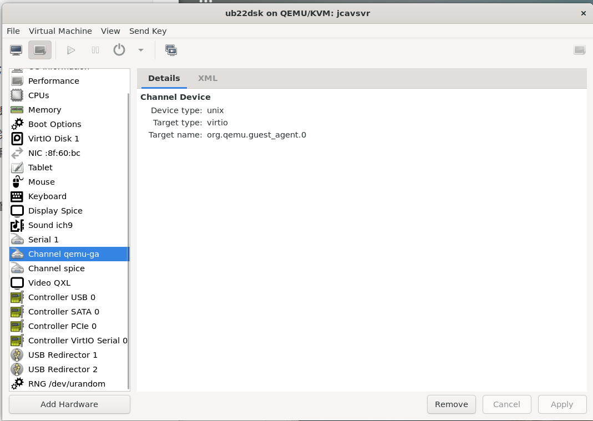

Channel 是宿主机到虚拟机的特殊通信通道，在避免网络通信的前提下实现数据交换。主要是 guest agent 在使用 channel。guest agent 是安装在虚拟机上与宿主机配合控制虚拟机的软件。例如 SPICE 远程桌面提供的 spice-guest-tools，VMWare 使用的 vmware-tools。通过 channel + guest tool 的配合，可实现远程桌面到虚拟机的剪切板共享、文件复制粘贴等大大提升操作体验的功能


### 总线控制器

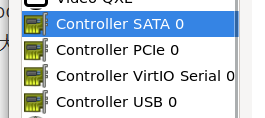

每种总线都需要一个控制器，让 libvirtd 自动配置即可


### 其他设备

还有一些零零碎碎的设备列举如下：

*   USB Redirector，其貌不扬但非常有用，使用远程桌面时可将本机的 USB 设备重定向到虚拟机。也就是说打开远程桌面，在本地插一块 U 盘，重定向到虚拟机，那在虚拟机中就可以像这个 U 盘就是插在虚拟机上一样操作这个 U 盘。USB 重定向操作方法如下：

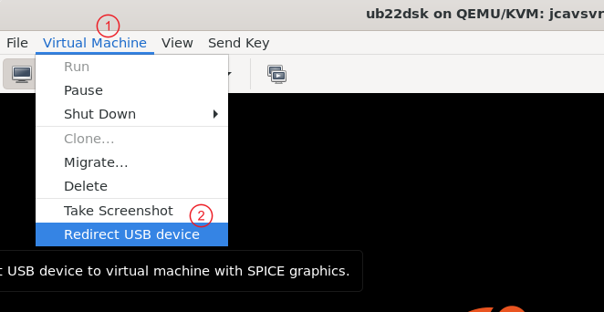

*   RNG，把宿主机的随机数生成直通给虚拟机
*   Sound，声卡，没啥好配置的
*   Smartcard，智能卡(RFID)阅读器
*   Watchdog，看门狗，在你的系统进入异常后完成重启等操作
*   Panic Notifier，虚拟机系统出现内核错误时通知宿主机
*   VirtIO VSOCK，实现虚拟机到宿主机或虚拟机间通信的设备，用来替代使用网络进行通信。核心买点是高效、简单、易移植
