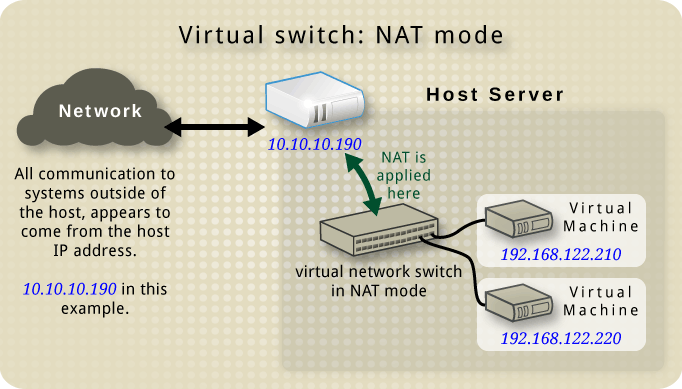

---
tags:
    - Linux
    - KVM
    - VM
    - Network
create_time: 2024-03-25
update_time: 2024-03-27
---


# 虚拟机网络配置

虚拟网络结构、功能需按照需求配置，典型例子：

* NAT 模式：为 guests 局域网分配局域网 IP
    * Guest -> Internet：使用 NAT 技术依托 host 的网络连接互联网
    * Guest <- Internet：需额外在 host 上配置端口转发
    * Guest <-> Guest：可访问
    * Guest --> Host：可访问
    * Guest <-- Host：可访问
* 隔离模式：为 guests 单独搭建一套网络
    * Guest -> Internet：无
    * Guest <-> Guest：可访问
    * Guest 与 Host：无法相互访问
* 共享网卡：相当于使用交换机连接 guest 和 host 的一个网口
    * Guest -> Internet：需要 guest 自行通过宽带拨号/DHCP等手段获取 IP
* 网卡直通
* 路由模式


<!-- more -->


参考资料：

* [libvirt: Virtual Networking](https://wiki.libvirt.org/VirtualNetworking.html)
* [libvirt: Networking](https://wiki.libvirt.org/Networking.html)
* [libvirt: Network XML format](https://libvirt.org/formatnetwork.html)
* [IPv6 address - Wikipedia](https://en.wikipedia.org/wiki/IPv6_address)
* [Unique local address - Wikipedia](https://en.wikipedia.org/wiki/Unique_local_address)
* [RFC3484  Default Address Selection for IPv6](https://www.rfcreader.com/#rfc3484)


此外，本文使用大量从 [libvirt: Virtual Networking](https://wiki.libvirt.org/VirtualNetworking.html) 下载的图片。


## Virtual Network Switches

libvirt 使用名为 virtual network switch (VNS)的虚拟器件提供虚拟网络。如果读者熟悉 OSI 模型，多半下意识认为这个 “switch” 对应链路层，功能应该与一个交换机类似。但此 switch 非彼 switch，取决于具体网络配置，virtual network switch 可能工作在链路层，也可能工作在网络层。

Libvirt 将 Virtual Network Switches 表示成这个样子：


虽然名字中带着个 "switch"，但他的设备名却显示为 “virbr0”，其中的“br” 暗示着是一个网桥。更让人迷惑的是，VNS 可以实现 NAT，一种通常是路由器才会提供的功能，所以 VNS 多多少少也能理解成一个路由器。

严格来说，switch、bridge、router 应该是不同的东西，VNS 提供又能实现这三种设备的功能，所以最好忽略这些文绉绉的名词定义，不要过多纠结。


## NAT 模式

### 基本使用

NAT 模式是 libvirt 的默认网络模式，VNS：

* 为虚拟机分配局域网 IPv4 地址
* 对 guest 发往 Internet 的数据包实施 SNAT，为 guest 提供网络访问
* 默认阻拦 Internet 到 guest 的数据包，除非它属于从一个从 guest 发起的连接
* 允许 guest 间、guest <--> host 的相互访问


网络结构图：




典型配置文件例：

``` xml
<network>
  <name>net_name</name>
  <uuid>UUID</uuid>
  <forward mode='nat' />
  <bridge name='virbr0' stp='on' delay='0'/>
  <mac address='52:54:00:4e:3c:17'/>
  <ip address='192.168.122.1' netmask='255.255.255.0'>
    <dhcp>
      <range start='192.168.122.2' end='192.168.122.254'/>
    </dhcp>
  </ip>
</network>
```


### 使 Guest 可从 Internet 访问

NAT 模式下 guest 只有局域网 IP 地址，若希望从互联网直接访问 guest，需先将数据发送到具有公网 IP 地址的 host，host 再通过端口转发将数据转发到 guest。本质上是做了一个 DNAT。

配置流程：

* 打开 Linux 的数据包转发，`sudo vim /etc/sysctl.conf`，添加一行：
  
    ```
    net.ipv4.ip_forward = 1
    ```

    然后执行 ` sysctl -p /etc/sysctl.conf` 应用更改

* 使用 `iptables` 配置 DNAT

但 iptables 的配置复杂且易错，还是使用程序自动配置为好。[libvirt: forwarding incoming connections](https://wiki.libvirt.org/Networking.html#forwarding-incoming-connections) 中提供了 3 种自动脚本，个人推荐这个 Python 项目：

* [saschpe/libvirt-hook-qemu: Libvirt hook for setting up iptables port-forwarding rules when using NAT-ed networking](https://github.com/saschpe/libvirt-hook-qemu)

该脚本将在虚拟机启动时自动启用 DNAP，在虚拟机关机时取消。比较好用


### 启用 IPv6

libvirt 默认只为 guests 分配 IPv4 地址，如要为 guests 分配 IPv6 地址，需修改网络的 xml 配置为：

``` xml
<network>
  <name>net_name</name>
  <uuid>UUID</uuid>
  <forward mode='nat' />
  <bridge name='virbr0' stp='on' delay='0'/>
  <mac address='52:54:00:4e:3c:17'/>
  <ip address='192.168.122.1' netmask='255.255.255.0'>
    <dhcp>
      <range start='192.168.122.2' end='192.168.122.254'/>
    </dhcp>
  </ip>
  <ip family='ipv6' address='fdXX:XXXX:XXXX:NNNN::1' prefix='64'>
    <dhcp>
      <range start='fdXX:XXXX:XXXX:NNNN::10' end='fdXX:XXXX:XXXX:NNNN::ff'/>
    </dhcp>
  </ip>
</network>
```

核心是添加了

``` xml
<ip family='ipv6' address='fdXX:XXXX:XXXX:NNNN::1' prefix='64'>
  <dhcp>
    <range start='fdXX:XXXX:XXXX:NNNN::10' end='fdXX:XXXX:XXXX:NNNN::ff'/>
  </dhcp>
</ip>
```

* 需要将 IP 地址中的 `X`、`N` 更改为随机的 16 进制字母
* `fdXX:XXXX:XXXX::` 属于 `fc00::/7` 地址段，是 unique local address (ULA)，可类比为 IPv4 中的局域网地址段
* `X` 构成 IPv6 中的 prefix 部分，`N` 构成 subnet ID 部分，一般没啥影响，随机一个地址即可


配置文件修改完成后，使用如下指令重启这个虚拟网络：

``` bash
sudo virsh net-destory net_name
sudo virsh net-start net_name
```


现在进入 guest，输入 `ip -c addr`，应该能看到获取到的 IPv6 地址。现在，你可以使用 IPv6 协议进行：

* 该网络下 guests 间通讯
* host 与该网络的 guests 间通讯


但 libvirt 默认关闭 IPv6 NAT，所以现在 guest 仍然无法使用 IPv6 协议访问 Internet。


### 启用 IPv6 NAT

虽然 IPv6 并不推荐使用 NAT，但也有些需要使用 IPv6 的场景，例如：

* Host 只能通过 IPv6 上网
* 你是中国大陆用户：
    * IPv6 网络环境比 IPv4 网络环境更加纯净，网速更快、没有那么拥挤、网络审查较少……
    * 网络运营商为你的 Host 提供的 IPv4 是局域网 IPv4，但为你提供公网 IPv6 地址，并且你希望能直接从互联网访问 guest
* 你正在使用中国教育网（CERNET）：为了鼓励 IPv6 发展，大部分高校并不收取 IPv6 流量费用，你希望顺应国家政策使用 IPv6 <span class="heimu">狠狠地薅国家羊毛</span>


可更具下属教程开启 IPv6 NAT：

* 在 Host 开启 IPv6 转发

    ``` bash
    # sudo vim /etc/sysctl.conf
    # add this line
    net.ipv6.conf.all.forwarding=1
    ```

* 将 VNS 的配置修改为：

    ``` xml
    <network>
    ...other configurations...
    <forward mode='nat'>
      <nat ipv6='yes'>
        <port start='50000' end='65535'/>
      </nat>
    </forward>
    </network>
    ```


现在你的 guest 能正常使用 IPv6 访问 Internet 了，但有个小瑕疵：

* 如果 Linux 系统既有 IPv4 地址又有公网 IPv6 地址，系统优先使用 IPv6 进行通讯
* 但因为分配给 guests 的是 `fc00::/8` 的 UCL 地址，系统会优先使用 IPv4 进行通讯


操作系统为什么这么做？

* [RFC3484  Default Address Selection for IPv6](https://www.rfcreader.com/#rfc3484) 定义了系统具有多个 IP 地址时如何选择的规则，默认偏好使用 IPv6 地址

* 几乎所有操作系统都遵循 RFC3484 的规则

* 因为 ULA 的[混乱历史](https://en.wikipedia.org/wiki/Unique_local_address)，ULA 地址很长一段时间内不可能被路由到。按照 RFC3484 的规则，系统将尝试使用 ULA 地址发起请求，但因为 ULA 地址不被路由，这样的请求多半会因超时失败，然后系统再尝试使用更低优先级的 IPv4 地址发起连接

* 这样“超时-重试”的过程引入大量网络延迟，所以大部分操作系统将 ULA 地址优先级降低到 IPv4 地址以下

    


为解决该问题，需要编辑 `/etc/gai.conf` 文件：

* `sudo vim /etc/gai.conf`

* 找到

    ``` bash
    #label ::1/128       0
    #label ::/0          1
    #label 2002::/16     2
    #label ::/96         3
    #label ::ffff:0:0/96 4
    #label fec0::/10     5
    #label fc00::/7      6
    #label 2001:0::/32   7
    ```

* 取消注释，并添加一行，使上述内容成为

    ``` bash
    label ::1/128       0
    label ::/0          1
    label 2002::/16     2
    label ::/96         3
    label ::ffff:0:0/96 4
    label fec0::/10     5
    label fc00::/7      6
    label 2001:0::/32   7
    
    label fd00::/8 1
    ```

* 保存，退出，验证系统偏好：

    在命令行运行

    ``` bash
    getent ahosts ident.me
    ```

    系统会按照该指令列出的顺序建立连接。

    如果是 IPv6 地址在前，说明系统偏好 IPv6，例如：

    ``` 
    2a01:4f8:c0c:bd0a::1 STREAM ident.me
    2a01:4f8:c0c:bd0a::1 DGRAM
    2a01:4f8:c0c:bd0a::1 RAW
    49.12.234.183   STREAM
    49.12.234.183   DGRAM
    49.12.234.183   RAW
    ```

    反之如果 IPv4 地址在前，说明系统偏好 IPv4，例如：

    ```
    49.12.234.183   STREAM ident.me
    49.12.234.183   DGRAM
    49.12.234.183   RAW
    2a01:4f8:c0c:bd0a::1 STREAM
    2a01:4f8:c0c:bd0a::1 DGRAM
    2a01:4f8:c0c:bd0a::1 RAW
    ```


上述修改背后的原理：

* RFC3484 Section 6 规定排序规则，与本例相关的是：

    * Rule 5: Prefer matching label
    * Rule 6: Prefer higher precedence
    * 且 Rule 5 优先级比 Rule 6 高

* 考虑默认配置：

    ```bash
    label ::1/128       0
    label ::/0          1
    label 2002::/16     2
    label ::/96         3
    label ::ffff:0:0/96 4
    label fec0::/10     5
    label fc00::/7      6
    label 2001:0::/32   7
    
    precedence  ::1/128       50
    precedence  ::/0          40
    precedence  2002::/16     30
    precedence ::/96          20
    precedence ::ffff:0:0/96  10
    ```

    `ident.me` 的地址

    * IPv6 为 `2a01:4f8:c0c:bd0a::1` 匹配到 label 1
    * IPv4 为 `49.12.234.183` 匹配到 label 4

    本机的地址：

    * IPv6 为 `fd12:8848:a2a2:1::74` 匹配到 label 6 
        (注意是最长前缀匹配，不是按照列表先后顺序匹配)
    * IPv4 为 `192.168.122.154` 匹配到 label 4

    按照 Rule 5，`ident.me` 和本机 `192.168.122.154` 的 label 相同，被优选选择，所以使用 IPv4 地址建立连接。

* 添加 `label fd00::/8 1` 一行后，`fd12:8848:a2a2:1::74` 被匹配到 label 1。
    * IPv4 和 IPv6 的本机 label 和目标 label 相同，Rule 5 不能排出顺序
    * 考虑 Rule 6，IPv6 优先级为 40、IPv4 优先级为 10，所以选择 IPv6 建立连接


  

### 配置 IPv6 DNAT

~~与 IPv4 不同，IPv6 暂时没有现成的 DNAT 自动配置脚本。~~ 管理员可通过如下指令配置 DNAT：

``` bash
GUEST_IP=xxxxxxxx
GUEST_PORT=22
VNS_DEV=virbr0
HOST_PORT=4023

sudo ip6tables -I FORWARD -o $VNS_DEV -p tcp -d $GUEST_IP --dport $GUEST_PORT -j ACCEPT
sudo ip6tables -t nat -I PREROUTING -p tcp --dport $HOST_PORT -j DNAT --to "[$GUEST_IP]:$GUEST_PORT"
```


如果需要自动配置，可以考虑使用该仓库：[GJCav/libvirt-hook-qemu](https://github.com/GJCav/libvirt-hook-qemu)

该仓库从 [saschpe/libvirt-hook-qemu](https://github.com/saschpe/libvirt-hook-qemu) fork 出，添加了对 IPv6 的支持，在作者的电脑上工作良好，已经向原作者提出 PR，正在等待审核


## 其他内容

等待施工....


