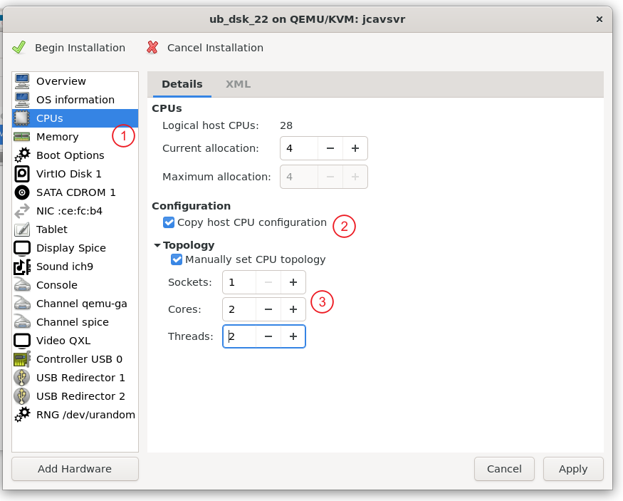

---
tags:
    - Linux
    - KVM
create_time: 2024-01-27
update_time: 2024-02-01
---

# QEMU-KVM-libvirt 生态与安装

简单来说：

* QEMU：一个模拟器，可用于模拟操作系统运行所需的各种硬件，包括 CPU、内存、主板、显卡、IO 外设等等设备。QEMU 可单独运行，纯软件模拟各个硬件，但性能会有较大损失。
* KVM：Linux 内核模块，一种硬件虚拟化技术，为 CPU、内存虚拟化提供硬件加速。
* QEMU-KVM：搭配 KVM 的 QEMU 版本，让 KVM 模拟 CPU、内存这类性能设备，减少性能损失。
* libvirt：一套非常流行的管理各类虚拟机的工具和 API，不仅能管理 QEMU-KVM 模拟的虚拟机，还能管理 VirtualBox 等其他虚拟机后端，大致包含：
    * virt-manager：具有图形界面的虚拟机管理工具
    * virt-viewer：远程桌面客户端，用于和虚拟机进行交互
    * virsh：命令行中的虚拟机管理指令


<!-- more -->

## 常用概念

1. Node / Host Machine / 宿主机：一台**物理机器**，用于运行虚拟机。一台宿主机可以运行多个虚拟机。
2. Hypervisor：用来管理、运行虚拟机的**软件**。这里就是 libvirt，类似的产品还有 VMWare 等。
3. Domain / Guest Machine / 虚拟机：在 Hypervisisor 中运行的操作的系统。
   
    *  Guest Machine 是歧义最少、最被接受的称呼
    *  “虚拟机” 有时被用于泛指虚拟化这套技术或整套生态
    *  Domain 是 libvirt 中使用的称呼


## KVM 套件安装

这里以 ubuntu 22 LTS 为例展示安装方法：

1. 保证系统各个软件包是最新的：
   ```bash
   sudo apt update
   sudo apt upgrade
   ```

2. 检查在 BOOT 时是否打开了 KVM 功能：
   ```bash
   sudo kvm-ok
   ```

   上述指令或许需要安装 `cpu-checker` 包，可使用 `sudo apt install cpu-checker` 安装。

   如果显示 KVM 未开启，你需要进入 BIOS 打开硬件虚拟化，然后再进入系统。
   
3. 安装 KVM 套件
   ``` bash
   sudo apt install \
   	qemu-kvm \
   	libvirt-daemon-system \
   	libvirt-clients \
   	bridge-utils
   ```

   其中：

   * qemu-kvm：启用了 KVM 加速的 qemu
   * libvirt-daemon-system：提供与 QEMU 交互的守护进程 `libvirtd`，这个进程是 KVM 套件最核心的进程。
   * libvirt-clients：与 `libvirtd` 交互的客户端
   * bridge-utils：创建、管理虚拟网桥、网卡的工具

4. `libvirtd`的启动与开机自启动
   
   ``` bash
   sudo systemctl enable libvirtd  # start at boot
   sudo systemctl start libvirtd   # start now
   sudo systemctl status libvirtd  # check status
   ```
   

如果最后一个指令显示 `libvirtd` 的状态是 `active(running)`，那么 KVM 套件已经安装完成。

**最后一步：为用户分配权限**

牢记，Linux 是一个多用户系统且有完善的权限限制，假设你希望用户 `userA` 可以管理虚拟机，那需要执行下列操作：

```
sudo usermod -aG kvm userA
sudo usermod -aG libvirt userA
```

这样 `userA` 才有权限管理虚拟机，否则只能 `sudo`提权，但这显然是不安全的。


## 现在，创建一个虚拟机运行 ubuntu 22

最简单的虚拟机管理方法是通过 `virt-manager` 进行管理。如果你的宿主机系统安装了用户界面，那可以：

```bash
virt-manger
```

启动该程序，看到如下界面（ub20-dsk）：

{:width="50%"}


现在就可快乐的使用鼠标创建虚拟机了。

下面以 Ubuntu22 Desktop 为例，展示图形化的虚拟机创建、管理。


右键 QEMU/KVM 这一栏，选择 New

{:height="40%"}

弹出虚拟机创建向导：

{width="50%"}


存在四种安装方法，这里仅仅展示从本地镜像安装，点击 Forward，然后点击 “Browse”，弹出 Storage Volume 选择窗。

{width="60%"}


点击左下角的 “Add Pool” 按钮。

{width="60%"}

名字按照你的习惯选择，类型选择 DIR，路径设置为保存 ubuntu 22 Desktop 镜像的那个文件夹。点击 Finish。然后类似下图选择要安装的系统镜像：

{width="80%"}

补充说明：

* libvirt 将所有会使用的储存空间分为“储存池” pool 和“储存分区” volume
* pool 可以普通的一个文件夹，也可能是其他一些更复杂的东西
* volume 在 osimg-1 池中就是一个个系统镜像，对应该文件夹下的所有文件
* 但在 default 池中，每个分区将是虚拟机的虚拟磁盘文件（.qcow2文件）
* 所以在不同的语境下，pool 和 volume 对应的东西可能不同，但暂时先不管这些高级特性


选好系统镜像后需要确定系统类型，libvirt 内部应该有一些针对性配置。这里找不到 Ubuntu 22 的类型，所以选择最接近的 Ubuntu 20，影响不大。

{width="50%"}


确定后点击 Forward，之后会配置一堆硬件参数，按实际情况选择，这里我的设置是：

* Memory: 8GB
* CPUs:  1
* :heavy_check_mark: Enable storage
* Create a disk of 40GB
* Name: ub_dsk_22
* :heavy_check_mark: Customize configuration before install
* Network selection: `Virtual network 'default': NAT`

其中最重要的应该是 Network selection，这里的 `default` 网络应该是安装 KVM 套件时默认创建的网络，它将虚拟机接入一个虚拟网络，并运行 NAT 协议让虚拟机访问互联网。建议第一次解除虚拟机的朋友暂且忽略其中的技术细节，听从建议选择该网络，待经验丰富后再折腾。

勾选 `Customize configuration before install` 是为了调整 CPU 相关设置，向导中对 CPU 的设置太简单了。不过毕竟是虚拟机，所有配置后续都可修改，这几步就算做错了也不会有任何严重后果。


点击 Finish，进入硬件编辑窗口：



按照上图进行配置。该配置含义为：

* `Logical host CPUs: 28` 宿主机的逻辑 CPU 有 28 个。我的宿主机 CPU 是 14 核 28 线程，对应数字 28.
* `Current allocation: 4` 启动虚拟机时允许虚拟机使用宿主机中的 4 个核心。该分配会随着虚拟机负载的变化而变化，但不会超过 `maximum allocation` 的值。
* `Copy host CPU configuration` 复制宿主 CPU 的型号作为虚拟机 CPU 的型号。不同型号 CPU 支持指令集有些许不同，比较省事的方法就是复制宿主机 CPU 型号。
* `Topology`：
  * `Sockets 1` 主板上插 1 个 CPU
  * `Cores 2` 这个 CPU 有 2 个核心
  * `Threads 2` 每个核心可运行 2 个线程（超线程）

然后点击左上角的 begin installation，开始安装后将弹出一个虚拟桌面，按照正常的 ubuntu 安装流程完成系统安装。

安装中会要求你“移除安装 media 再 press enter 重启”，忽略他，直接按回车重启。

