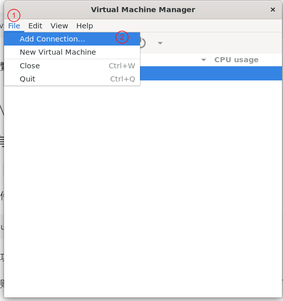
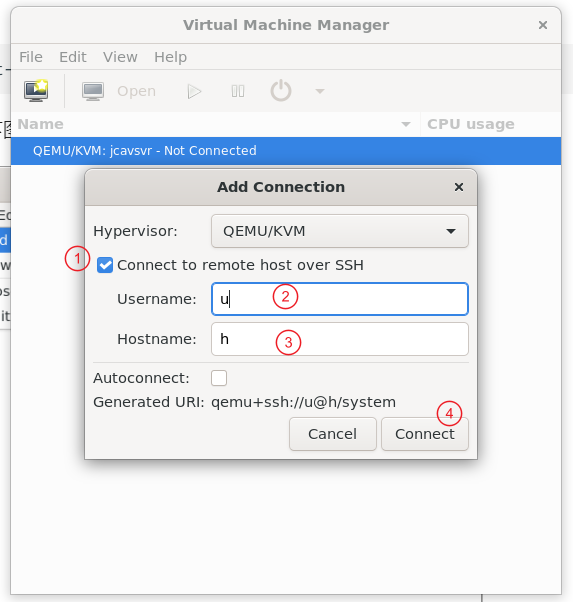
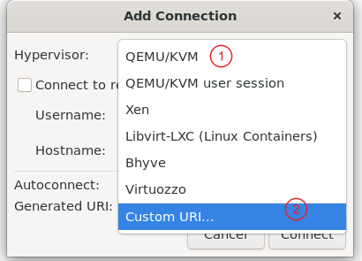

---
tags:
    - Linux
    - KVM
    - QEMU
create_time: 2024-02-01
update_time: 2024-02-03
---

# 远程管理

在安装有图形桌面的宿主机上使用 virt-manager 管理虚拟机非常方便，但更多时候宿主机被用作服务器，一般不会安装图形界面，而是从其他电脑通过 SSH 等工具远程连接到宿主机并操作，前文提到的管理方法不再适用。

本文的“本地”，指具有用户界面的一台电脑，且这台电脑能够通过 ssh 连接到宿主机。

此时有推荐两种方法：

* 命令行管理：SSH 到宿主机，然后使用 `virsh` 等命令行工具管理虚拟机
    * 使用范围广：本地无需安装其他软件
    * 操作复杂：需要使用一个个命令行指令操作，不如图形界面来得直观
    * 适合简单的管理任务，例如启动虚拟机、关闭虚拟机、查询正在运行的虚拟机
    * 适合自动化管理：可以编写脚本批量创建、修改虚拟机
    * 不适合复杂的管理任务，例如添加一张直通的网卡、添加一些 USB 端口
* virt-manager 远程连接：在本地安装 `virt-manager`，配置到宿主机的远程连接，实现对宿主机上虚拟机的远程管理
    * 使用条件稍苛刻：需要在本地安装 virt-manager。但该软件只能装在 linux 系统中，要想在 Windows 系统中安装必须先启用 WSL 2 和 WSLg，再在 WSL2 中安装 virt-manager。但此时远程桌面的性能较差。
    * 操作简单：谁不喜欢用户界面的管理方式呢？
    * 适合复杂的管理任务：不需要手动编写虚拟机配置文件，图形化操作容易得多

两种方法各有优劣，按具体场景选择合适方法最重要。后文只介绍两种方法的基本使用，不会涉及到特别具体的管理任务，例如给虚拟机添加一张 PCIE 直通的网卡。这些任务的配置方法可参考本站其他文章。

此外，如果只是想用远程桌面连接到虚拟机，可使用 `virt-viewer`。`virt-viewer` 是 `virt-manager` 的一个组件，使用 SPICE 协议连接到虚拟机并在本地打开远程桌面。值得注意的是，virt-viewer 有 Windows 版本，可直接安装，比 virt-manager 方便的多。


<!-- more -->


## 命令行远程管理

### ssh 连接后使用 virsh

本质上就是在宿主机终端上管理虚拟机，只不过是通过 ssh 在宿主机上打开终端。这是最常用的方法。


### 使用本地 virsh 管理远程虚拟机

可使用

``` bash
virsh --connect URI
```

直接连接到由 `URI` 标识的远程机器，但说实话基本不会这么做。


## Connect URI 示例

无论是前文的 `virsh --connect` 还是后文的  `virt-manager` 远程管理配置，写出符合规范的 `URI` 都是最核心的步骤，针对远程管理这一场景，下面给出常见的 `URI` 构造方式：

*   `qemu+ssh://userA@hostname/system` 连接到电脑 `hostname` 上用户 `root` 的 `libvirtd` 实例，使用 SSH 认证身份并实现加密通信
*   `qemu+ssh://userA@hostname/session?socket=<path>` 连接到电脑 `hostname` 上用户 `userA` 的 `libvirtd` 实例
    *   socket 路径可查阅官方文档[libvirtd: run as non-root](https://libvirt.org/manpages/libvirtd.html#when-run-as-non-root) ，位于 `$XDG_RUNTIME_DIR/libvirt/libvirt-sock`
    *   参考 [How to use virt-manager as a non-root user?](https://www.reddit.com/r/AskFedora/comments/c9z64p/how_to_use_virtmanager_as_a_nonroot_user/) 的意见，不建议使用 session 实例，因为：
        * session 实例并不随着系统的启动而创建，所以可能直接连接不上
        * session 的 libvirtd 进程权限非常受限，对网络配置有非常大的限制

注：关于 `session` 和 `system` 的区别，可参考[命令行管理虚拟机 | 列出虚拟机](cli-management.md#_3)


有时为了方便 ssh 连接，会在本地创建 `~/.ssh/config` 并配置类似下面的配置：

``` txt
Host nickname
	HostName real_hostname
	User username
```

现在 URI 可变为：

*   `qemu+ssh://nickname/system`


URL 格式参考

*   [Chapter 18. Remote Management of Guests | Red Hat Customer Portal](https://access.redhat.com/documentation/en-us/red_hat_enterprise_linux/7/html/virtualization_deployment_and_administration_guide/chap-remote_management_of_guests#form-Transport_modes-Remote_URIs)
*   [libvirt: Connection URIs](https://libvirt.org/uri.html#remote-uris)


## Virt-Manager 远程连接

### 在具有图形化界面的 Linux 系统中配置

这里以 `Ubuntu 22 Desktop` 为例讲解

前提条件，本机能够 ssh 到想要管理的宿主机，即：

``` bash
ssh username@hostname
```

能够成功登录宿主机。

此外，账户`username`还得有足够的权限(`libvirt`和`kvm`)来管理虚拟机。


本机安装 `virt-manager`

``` bash
sudo apt install virt-manager
```

启动

``` bash
virt-manager
```

按照下图点击：

{:width="60%"}

弹出类似下图的窗口：

{:width="60%"}

*   选中 `Connect to remote host over SSH`
*   填写用户名、宿主机的 hostname
*   然后点击 "Connect"

如果一切顺利，管理列表中就会多出一项。现在就可想管理本机一样管理远程宿主机的虚拟机了。


如果想更加自由的连接到远程宿主机，按照下图操作，在 `Add Connection` 页面中：

{:width="60%"}

选择 `Custom URI`，然后填入：

```
qemu+ssh://nickname/system
```

或者其他符合规范的 URI，点击 `Connect` 建立连接。


### 在 Windows 电脑中配置

`virt-manager` 只有 Linux 版本，所以必须使用 WSL 和 WSLg 来安装 `virt-manager`

1.   参考 [安装 WSL | Microsoft Learn](https://learn.microsoft.com/zh-cn/windows/wsl/install) 安装 WSL 2
2.   参考 [使用 WSL 运行 Linux GUI 应用 | Microsoft Learn](https://learn.microsoft.com/zh-cn/windows/wsl/tutorials/gui-apps) 检查是否能显示 WSL 中的 GUI 应用
3.   在 WSL2 的 Linux 机中安装 `virt-manager`
4.   其他步骤同上小节


已知缺陷：

*   远程桌面性能较弱，比较卡顿。如果只是想在 Windows 上用远程桌面连接到虚拟机，那推荐使用 `virt-viewer`


