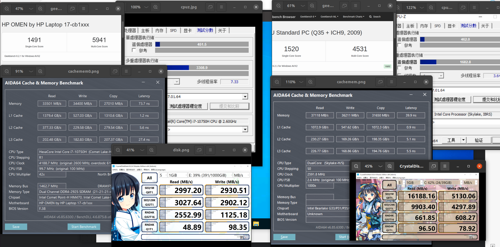
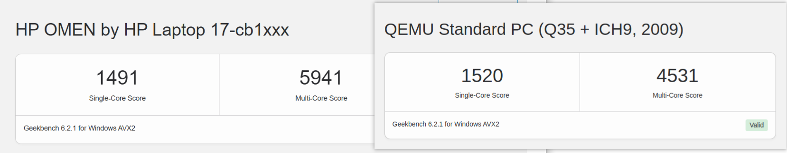
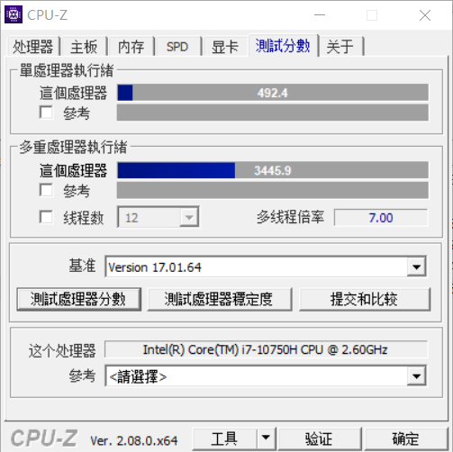
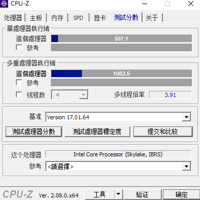
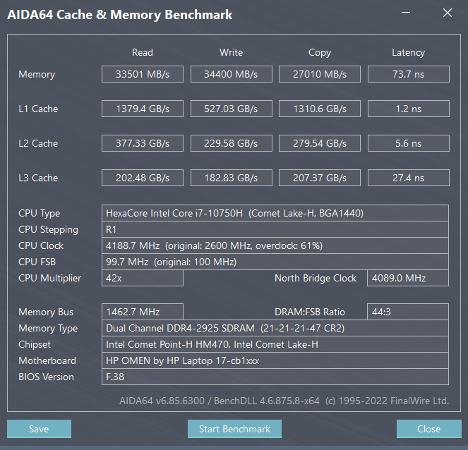
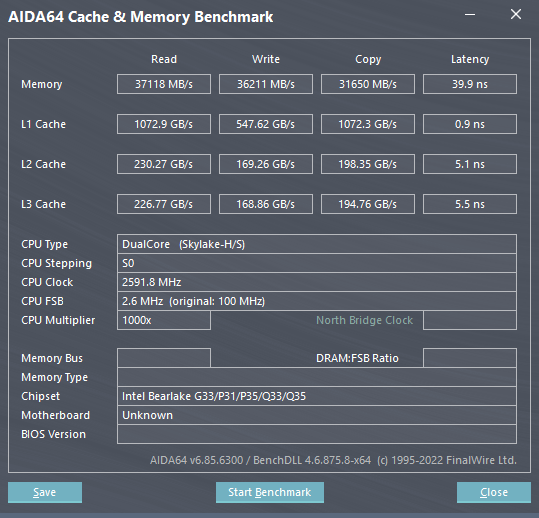
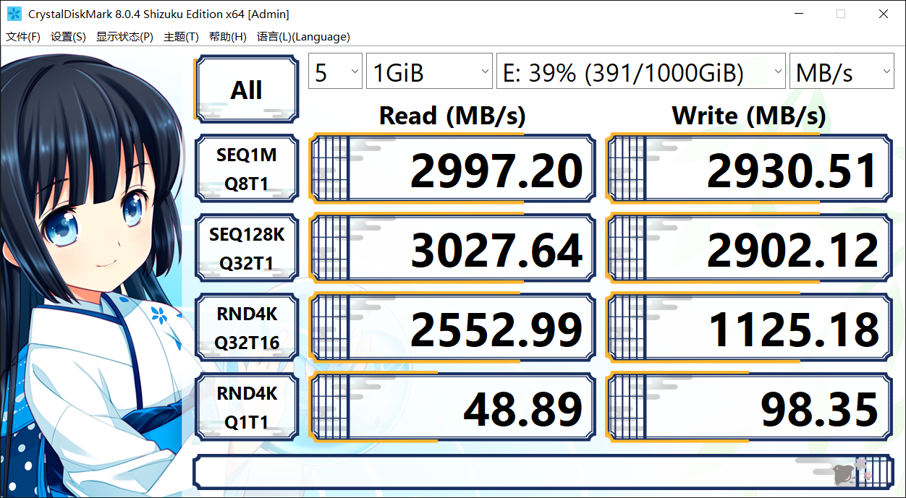
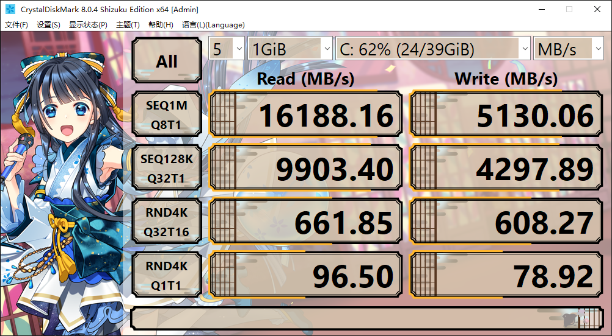

---
tags:
    - Linux
    - KVM
    - QEMU
create_time: 2024-03-09
update_time: 2024-03-09
---

# Win on KVM 性能测试

总结：相比原生 Win，Win on KVM

* CPU：
  * 单核性能几乎没有损失，有时甚至小胜一筹
  * 多核性能：给虚拟机分配 1/3 的核显甚至能获得 2/3 的多核性能
* 内存 & L123 缓存：读写速度有明显损失，但延迟却大幅下降
* 虚拟硬盘：
  * VirtIO 虚拟硬盘的多线程随机读写、单线程随机写入性能较差
  * 但其他场景下反而优化低端固态硬盘性能

<!-- more -->

## 背景

有一段时间笔者非常迷恋 Linux，甚至考虑将主力操作系统从 windows 切换到 linux，但这就意味着我需要抛弃在 win 中使用多年的软件与生态，我的需求是：

* 办公：最好有毕竟原生体验的 Office 套件以及运行常用的聊天软件，SB脑瘫微信
* 游戏：需要流畅运行各类 3A 游戏

但这需求一列，就几乎与 linux 无缘。我最后的挣扎是在 Linux 使用 KVM 运行一个 windows，实现生态融合。大体思路：

* KVM 运行一个 win 虚拟机，跟随我的系统一起启动
* 使用 RDP 远程连接到 win 虚拟机，
  * 对 windows，RDP 是效率最高的远程桌面，同时
  * RDP 支持剪切板同步、文件拷贝

至此，通过极少的配置就可获得近乎原生的办公体验。但对于游戏，情况就更加复杂。我不希望以双系统的形式满足游戏需求，这样我还不如用 Win 做主力系统然后安装 linux 虚拟机。所以我的选择是 GPU 直通，具体来说

* 动态地从宿主机解绑显卡直通给 win 虚拟机
* 当 win 虚拟机关闭时，将显卡重新绑定到宿主机
* 使用 LookingGlass 将虚拟机图形输出到宿主机，且将对宿主机的键鼠操作重定向到虚拟机

这套方案的优势：

* 无需重启系统
* 不打游戏时宿主机也可享用高性能 GPU
* 只需要 1 套显示器、键鼠

但这套方案的前提条件是：

* 推荐使用 2 块显卡，但最少只需要 1 块显卡
  * 毕竟宿主机、虚拟机都需要图形输出，比较省钱的组合是亮机卡+高性能卡或者核显+高性能卡
  * 如果真的只有 1 块显卡，例如在笔记本上实现该方案，也勉强能用
* **虚拟机不会造成游戏性能下降**

所以就先测测 Win on KVM 的理论性能。这里只测量 CPU、内存、硬盘的性能，显卡性能、游戏真实性能还未测量。

## 测试平台

物理机器：惠普 暗影精灵 6Plus

* CPU：i7-10750H 6C12T 没错我就是免费升级 10850 前入手的倒霉蛋

其他参数不占主导因素其实是我搞忘了，省略不计

Linux 系统：Ubuntu 22.04 LTS

虚拟机分配硬件参数：

* CPU：**2C4T** 其他参数复制宿主
* 内存：8GB
* 硬盘：40G VirtIO 虚拟硬盘，其他参数保持默认

测试软件：

* CPU：
  * CPU-z
  * Geekbench 6
* 内存：AIDA 64
* 硬盘：CrystalDiskMark 8

## 测试结果

### CPU 性能

Geekbench 6：

> 左侧：原生 Windows 测试
>
> 右侧：Win on KVM

CPU-Z

* 原生
  

* on KVM
  

总结：

* 单核性能：几乎相同，甚至虚拟化后还小胜一筹
* 多核性能：考虑到给虚拟机分配的是 2C4T CPU，朴素的想法是多核性能是就是原来的 1/3，但测试结果却显示虚拟机多核性能大概是原来的 2/3，衰减的很少
* 所以 KVM 的 CPU 效率其实非常高，几乎没有性能损失

### 内存 & L123 缓存跑分

原生 win：

win on kvm：

Win on KVM 相比原生 win

* 内存、L123 读写、拷贝性能有所衰减
* 但读写延迟大大降低
* 低延迟或许利好 FPS 游戏？

### 硬盘

注：测试使用的固态硬盘是一块杂牌固态，无缓存 QLC 颗粒 1T，请不要期待它有多强的性能

原生 win：

Win on KVM：

虚拟化后相比原生系统

* 顺序读写爆杀原生，毕竟虚拟硬盘默认打开了缓存，顺序读写这种简单行为的缓存命中率很高，相当于 Win on KVM  其实是在读写内存，自然性能强
* 单线程随机读取性能爆杀原生，直接把这块垃圾硬盘的性能提升到不属于它的高度
* 单线程随机写入性能有些许衰减
* 多线程随机读写性能衰减非常大，应该是 VirtIO 自身多线程优化差导致的
