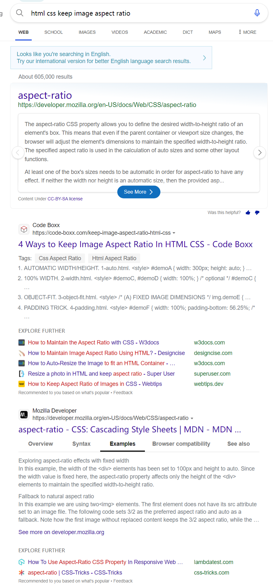

---
tags:
    - CSS

create_time: 2024-02-03
update_time: 2024-02-03
---

# 图像样式

默认居中、80% 宽度、最大高度 30rem。


<!-- more -->

## 测试

宽、矮图片


细、长图片




## 格式覆盖

### 全宽图片

使用 `.img-w100` 类型，使用例：

``` markdown
{: .img-w100}
```

效果：{: .img-w100}


原理：

``` css
.img-w100 {
	max-width: 100% !important;
	max-height: none !important;
}
```

