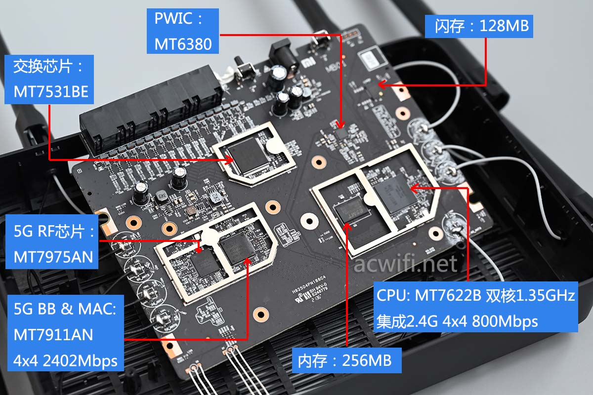

---
tags:
    - WiFi
    - Xiaomi
    - Router

create_time: 2024-02-05
update_time:  2024-02-05
---


# 小米路由器 AX6S 折腾

在 22 年 7 月我给家里面购买了小米 A6S 路由器。说实话买前只是想着升级到 WiFi 6，看了看测评，因为这款路由器性价比较高就直接下单了。挑选时完全没想到要折腾这么多，对我来说路由器只要本本分分的做好它的本职工作即可，软路由要用到的其他功能我有另一台服务器实现。但官方提供的后台不能配置 IPv6 防火墙，要么就是完全没有防火墙，要么就是阻拦所有入站连接。这二极管思维简直让我如鲠在喉，完全不能发挥国家花大力气推广 IPv6 的成果。所以就有了后续一系列的折腾，主要包括：

*   了解 AX6S
*   启用 telnet、ssh
*   配置 ssh 免密码连接
*   手动配置 IPv6 防火墙


<!-- more -->


## 了解 AX6S

小米 A6S 和 小米 AX3200 共用同一套硬件，但有如下区别：

*   小米A6S 是国内版，型号为 RB03
*   小米AX3200 是国际版，型号为 RB01

不过请不要尝试将国际版固件刷入中国版硬件，小米采取了一些措施防止跨区刷固件

按照这份[拆机报告](https://www.acwifi.net/16612.html)，A6S 核心硬件如下：



这一套硬件性能足以覆盖家庭使用场景，用料正常，价格合适。内存、闪存大小完全够用，比 TP-LINK 系列路由器富余得多。

软件上，[官方商品页面](https://www.mi.com/shop/buy/detail?product_id=15032)大大方方得承认使用“基于 OpenWRT 深度定制的智能路由器操作系统 MiWiFi ROM”，所以后续折腾不仅仅可从恩山论坛查找资料，还可参考 OpenWRT 的官方文档。OpenWRT 甚至有文档教大家如何在 A6S 上安装 OpenWRT

*   [OpenWrt Wiki: Xiaomi AX3200 / Redmi AX6S](https://openwrt.org/toh/xiaomi/ax3200)：能找到 AX6S的一些参数以及安装 OpenWRT 的教程
*   [Adding OpenWrt support for Xiaomi "Redmi Router AX6S"/"Xiaomi Router AX3200"OpenWrt Forum](https://forum.openwrt.org/t/adding-openwrt-support-for-xiaomi-redmi-router-ax6s-xiaomi-router-ax3200/111085)：OpenWRT 论坛上讨论 AX6S 的帖子，内容有些零碎，但里面连接到了许多有用的资料


## 掌控你的机器

折腾路由器的第一步永远是开启 telnet、开启 ssh，但我做这些操作已经是两年前的事了，很多细节记不清晰，所以我将列出各个步骤参考的文章，细节之初读者可自行阅读：

*   检查路由器是否已经开启 telnet

    当时我大多参考恩山论坛上的这篇教程 [AX6S 可以无拆开telnet了](https://www.right.com.cn/forum/thread-8178782-1-1.html)。但我的操作比较玄乎，按照教程，我应该刷入内测版固件，但那个固件我一直刷不上去，一生气不管了直接 telnet 连接居然就连上了，甚至不需要密码，也就是说我的 AX6S 是默认开启 telnet 的，总的来说就是很玄学。但查阅资料后了解到有可能我的机器一直处在工厂模式，所以 telnet 默认开启，可以在浏览器中打开连接 [http://192.168.31.1/cgi-bin/luci/api/xqsystem/fac_info](http://192.168.31.1/cgi-bin/luci/api/xqsystem/fac_info) 来验证，浏览器显示内容应该类似：

    ``` txt
    {"telnet":true,"init":true,"wl0_ssid":"mi_wifi1","ssh":true,"version":"1.0.57","facmode":true,"4kblock":false,"secboot":false,"wl1_ssid":"mi_wifi2","uart":true}
    ```

    仔细观察各个属性就可知道自己的 AX6S 有没有开启 telnet, ssh，是否处于工厂模式

*   开启 telnet：下面是一些我现在看来比较具有参考意义的教程

    *   [lemoeo/AX6S](https://github.com/lemoeo/AX6S/blob/main/README.md)：中文写的解锁 telnet、SSH 刷入 OpenWRT 教程，容易阅读
    *   [YangWang92/AX6S-unlock](https://github.com/YangWang92/AX6S-unlock)：这个教程年代稍稍久远一些，使用英文撰写
    *   连接 telnet 需要输入密码，这个密码需使用机器 SN 码计算，上面两个教程都有说明如何操作
    *   2 年前我操作时应该只做了开启 telnet、ssh 然后选择编写脚本在每次开机时启动 ssh 服务。因为我不想做那么多操作去修改固件，就没有做 SSH 固化，使用脚本自动开启 ssh 已经能够满足我的需求
    *   自动开启 SSH 的代码可参考 [固化后解锁 SSH 服务](https://github.com/lemoeo/AX6S/blob/main/README.md#固化后如何解锁-ssh-服务)，我也不太记得为啥我不用固化就可这么操作

*   配置 SSH 免密码连接：

    *   在 `/data/` 目录创建文件 `authorized_keys`

    *   将自己常用设备的公钥拷贝到这个文件

    *   写一个开机自启动的脚本，脚本内容为
        ``` bash
        ln -s /data/authorized_keys /etc/dropbear/authorized_keys
        ```

        把刚创建的文件软连接到 `/etc/dropbear/authorized_keys`

    *   现在尝试 SSH，如果配置无误，即可实现免密码登录

    *   不熟悉 SSH 不知道公钥、私钥是什么？建议在网上搜索学习 SSH 免密码登录配置、RSA 非对称加密概念

    *   为什么不直接把公钥写入 `/etc/dropbear/authorized_keys`，反而转几个弯最后链接过去？因为 `/etc/dropbear` 整个文件位于 `/dev/root` 文件系统，系统类型是 `squashfs`，这是一个只读的文件系统。换句话说，直接在对 `/etc/dropbear/` 路径下所有文件的修改在重启路由器后都会丢失。而 `/data/` 路径文件系统是 `ubi1_0` ，文件系统类型是 `ubifs`，该路径下的文件保存在非易失型闪存中，重启后文件内容仍然存在。所以得绕个弯子写脚本。后文将更细致地介绍 AX6S 的文件系统

*   编写 IPv6 防火墙：

    按道理应该使用 OpenWRT 提供的 [NetFilter](https://openwrt.org/docs/guide-user/firewall/firewall_configuration) 工具配置防火墙策略，但当时折腾的时候没意识到 AX6S 使用的是 OpenWRT 系统，所以就我一波操作猛如虎，直接写了一套 iptables 指令来配置 IPv6 防火墙。基本过程是：

    `/data/etc/config/firewall` 最后添加一小段代码：

    ``` txt
    config include 'user_rules'
            option type 'script'
            option path '/data/firewall_ipv6.user'
            option family 'IPv6'
            option enabled '1'
    ```

    当时我也没细究这到底有啥功能，但效果就是系统启动时会自动执行 `/data/firewall_ipv6.user` 这个文件，这个文件就是一个可执行的脚本，内容如下：

    ``` bash
    #!/bin/sh
    ### Custom IPv6 Firewall rule ###
    
    ip6tables -C forwarding_rule -p tcp --dport 8000:10000 -j ACCEPT >/dev/null 2>&1
    
    if [ $? != 0 ]; then
            ip6tables -I forwarding_rule -p tcp --dport 8000:10000 -j ACCEPT >/dev/null 2>&1
            ip6tables -I forwarding_rule -p tcp --dport 50000:60000 -j ACCEPT >/dev/null 2>&1
    
            ip6tables -I forwarding_rule -p udp --dport 8000:10000 -j ACCEPT >/dev/null 2>&1
            ip6tables -I forwarding_rule -p udp --dport 50000:60000 -j ACCEPT >/dev/null 2>&1
    fi
    
    
    # run at reboot
    if [ ! -e /tmp/user_init_runed ]; then
            touch /tmp/user_init_runed
            sh /data/init.user
    fi
    ```

    前半段添加两个放行的端口端，后半段是屎山代码之一，用来调用我另一个开机自启动脚本吗，`init.user`内容如下：

    ``` bash
    #!/bin/sh
    
    # Start dropbear and configure authkeys
    sed -i "s/channel=\`.*\`/channel=\`debug\`/" /etc/init.d/dropbear
    ln -s /data/authorized_keys /etc/dropbear/authorized_keys
    /etc/init.d/dropbear start
    ```

    作用是配置公钥后开启 SSH


这一套小连招虽然非常的屎山，但已经在我的路由器上稳定运行 2 年，其中大概有 5-8 次意外断电和重启，都没出现任何问题，虽然是一坨屎山，但也是稳定的屎山。

<br/>

以上就是我在 AX6S 上的折腾，毕竟我的机器自带无密码 telnet，所以做的修改其实很少，添加的功能也很少很克制。个人建议不要太折腾路由器，网络服务提供设备最重要的是稳定、高性能，从而提供一个健壮的网络环境。网上许多折腾软路由、折腾 OpenWRT 从而实现的功能其实最好的归宿是在网络中单独建立一台服务器，依托路由器提供的高速、稳定的网络为局域网用户提供服务。但这套方案对普通消费者要求有些过高，至少得对计算机网络、计算机操作系统有深入理解才能自行搭建。<span class="heimu">所以最终的建议是别折腾。

</span>

## 附：AX6S 的文件系统

打开远程终端，输入 `df -hT`，输入如下：

``` txt
Filesystem           Type            Size      Used Available Use% Mounted on
/dev/root            squashfs       15.3M     15.3M         0 100% /
tmpfs                tmpfs         115.1M    372.0K    114.8M   0% /tmp
ubi1_0               ubifs          40.4M   1020.0K     37.3M   3% /data
ubi1_0               ubifs          40.4M   1020.0K     37.3M   3% /userdisk
/dev/root            squashfs       15.3M     15.3M         0 100% /userdisk/data
ubi1_0               ubifs          40.4M   1020.0K     37.3M   3% /etc/config
ubi1_0               ubifs          40.4M   1020.0K     37.3M   3% /etc/datacenterconfig
ubi1_0               ubifs          40.4M   1020.0K     37.3M   3% /etc/smartcontroller
ubi1_0               ubifs          40.4M   1020.0K     37.3M   3% /etc/parentalctl
ubi1_0               ubifs          40.4M   1020.0K     37.3M   3% /etc/smartvpn
ubi1_0               ubifs          40.4M   1020.0K     37.3M   3% /etc/ppp
ubi1_0               ubifs          40.4M   1020.0K     37.3M   3% /etc/crontabs
tmpfs                tmpfs         512.0K     32.0K    480.0K   6% /dev
```

*   `/tmp` 是机器上那 256MB 的内存，但为啥我这里是 115M 实在是让我百思不得其解
*   `/dev/root` 是只读的文件系统，对他的修改本质上是在内存上修改，重启后丢失
*   `ubi1_0` 是适合闪存的文件系统，这里的闪存就是硬件拆解中提到的 128MB 闪存，重启后闪存上的数据不会丢失。但这里只有 40MB 也非常奇怪

闪存大小只显示 40MB 可解释为 AX6S 采用双系统分区，把闪存劈成 2 半，一半放一个系统。但为啥我的内存只有 115M 就真的很玄乎了。另一方面，AX6S 的系统非常精简，没有 `lsblk` 这些指令，我一时半会还不知道怎么深入研究，所以暂且搁置这些其妙问题吧。


