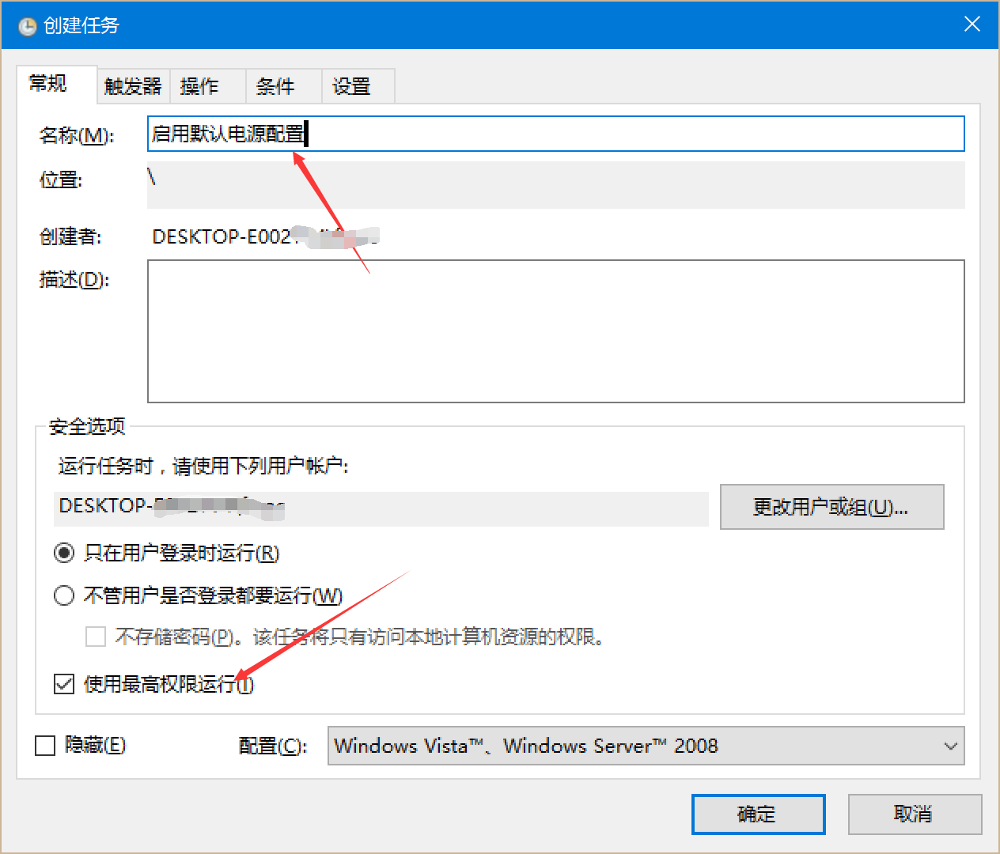
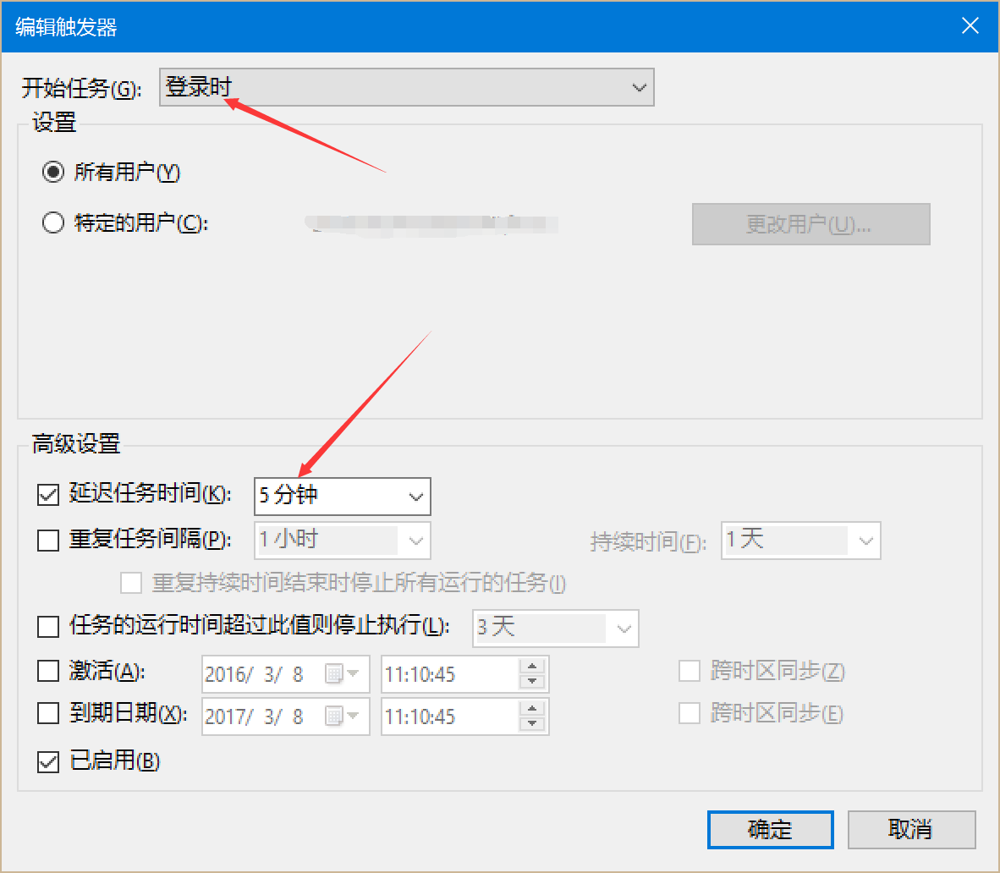
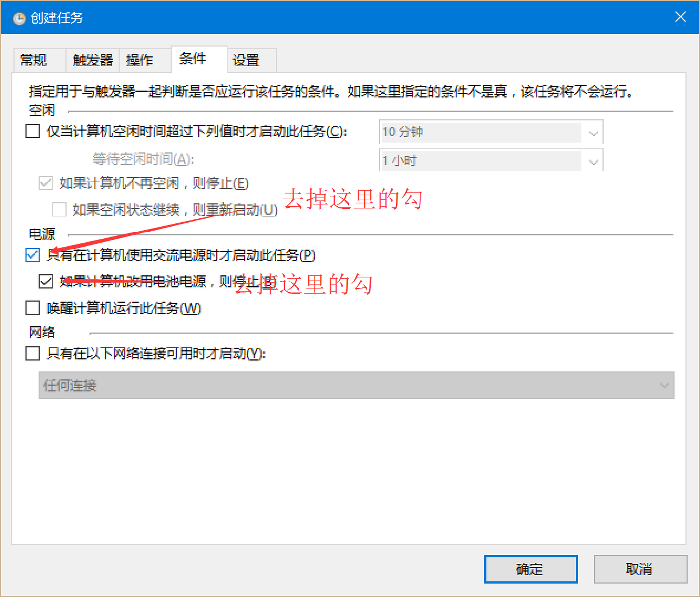
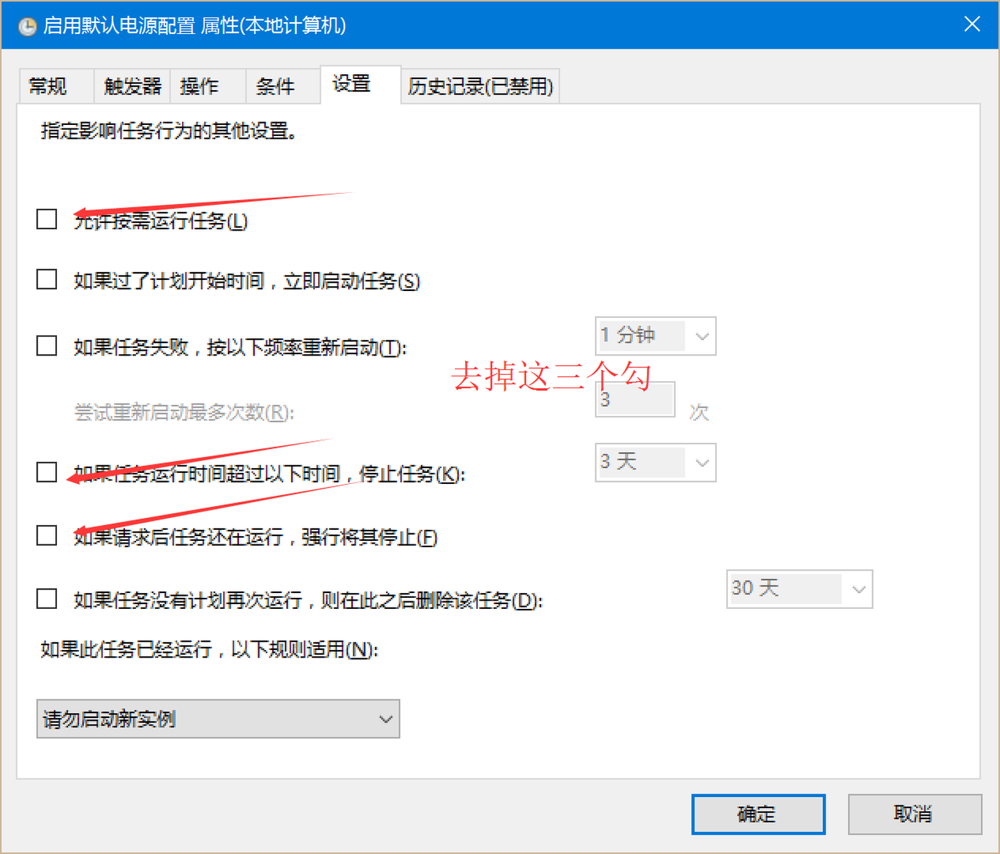
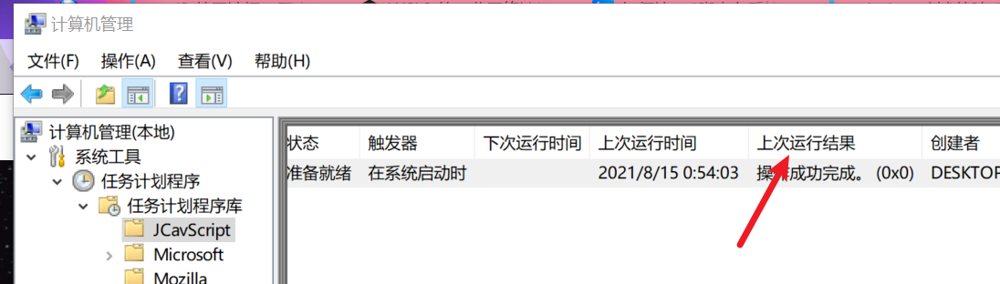

---
tags:
    - win
    - cron
create_time: 2023-07-19
update_time: 2023-07-23
---

# win-计划任务

> 类比 linux 中的 cron

> 参考了 https://zhuanlan.zhihu.com/p/20628937 的教程

!!! danger "警告"

    下面的配置使用“最高权限”运行计划，这或许会对你的计算机安全造成影响，请自行评估风险。

## 配置

打开`计算机管理`-`任务计划程序`，在右侧找到`新建任务`。

一般来说可以适当减弱权限

此处甚至可以选择`不管用户是否登录都要运行`

然后再`操作`选项卡添加执行的命令。

**注：** 可以去掉上图中后第一个，即：`按需运行`

## 常见错误

### 查看错误

打开`计算机管理`，找到添加的任务，有一个`上次运行结果`，这里可以查看错误码。

### 错误 0x41301

> 来源：https://blog.csdn.net/weixin_44635274/article/details/107923716
> 
1. 不能有类似 pause 的命令，脚本不能等待
2. 选择`不管用户是否登录都要运行`，勾选最高权限，采取保存密码方式，记住运行此计划的用户
3. 打开`控制面板`、`管理工具`，然后打开`本地安全策略`。在`本地安全策略`窗口中，依次单击`本地策略`、`用户权限分配`，然后单击`作为批处理作业登录`，把执行计划的用户添加进去